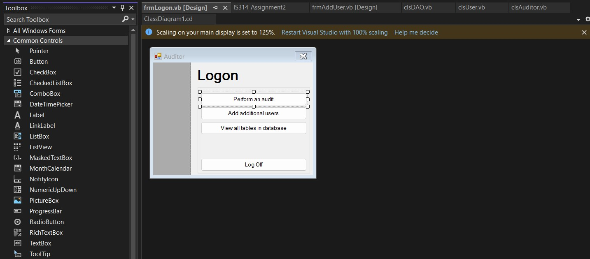

# IS314 - Audit Project

The three projects in this repository made up the bulk of the [IS314 - Advanced Business Programming](https://catalog.uwec.edu/courses/is/) course at the [University of Wisconsin - Eau Claire](https://www.uwec.edu). The second and third projects were built upon prior work:

1. Initial WinForms prototype with no database connectivity
2. WinForms application with MySQL database connectivity
3. WinForms to ASP.Net WebForms migration with MySQL database connectivity

It was created in 2008 and contains security vulnerabilities due to poor programming practices. Please do *not* use [string concatenation to build SQL queries](https://owasp.org/www-community/attacks/SQL_Injection), and please do *not* store passwords in [plain-text](https://owasp.org/www-community/vulnerabilities/Password_Plaintext_Storage).

It has been uploaded and archived to GitHub for posterity.

